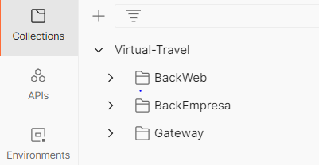
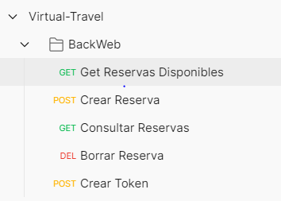
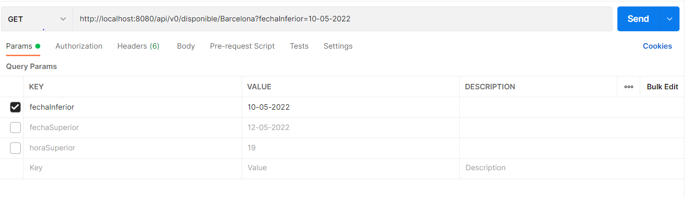
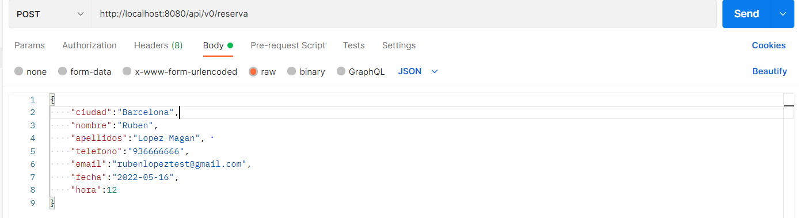
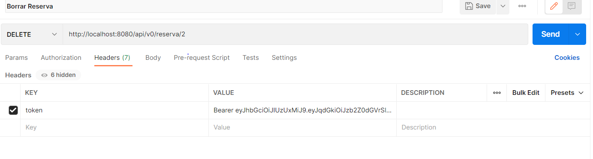
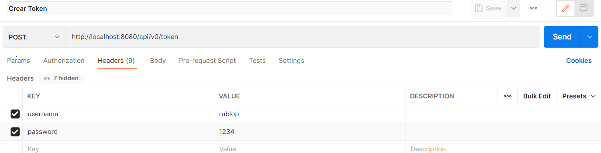
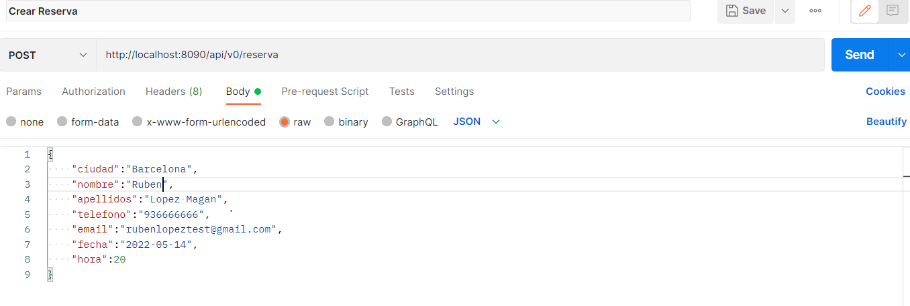
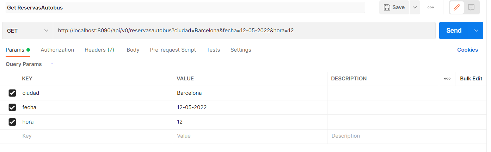
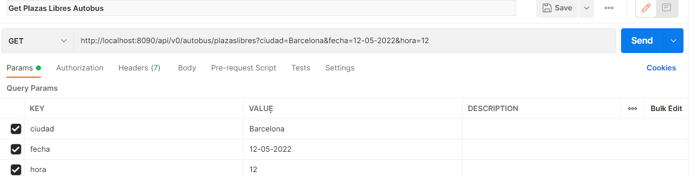
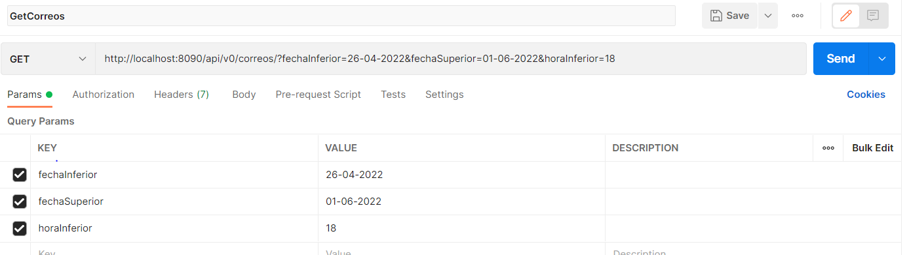

# Virtual Travel

Aplicaciones:

- BackEmpresa
- BackWeb
- EurekaServer
- Gateway

Lógica Ejercicio:

Backweb es la aplicación que gestiona la base de datos de la web, puede recibir peticiones
de altas de reservas y puede haber más de una instancia de la aplicación. Al recibir una petición para dar 
de alta una reserva, se comunica con BackEmpresa a través de Kafka y si, ha sido aceptada envía esta
reserva al BackEmpresa para que haga las correspondientes comprobaciones, y si es posible
añadirá la reserva a la base de datos del BackEmpresa y enviará un correo con la confirmación
y los datos de dicha reserva.

El BackEmpresa también podrá recibir peticiones de alta de reservas y cada cierto tiempo,
también mediante Kafka comunicará las reservas al Backweb para actualizar su base de datos.

Con Eureka Server y Gateway, se podrán tener en cuenta que puede haber diferentes instancias del backweb y
se balancearán las peticiones entre las diferentes instancias.

Colección Postman:

Endpoints BackWeb:

- GetReservasDisponibles: No implementa seguridad, tiene que recibir obligatoriamente como
parámetro la fecha inferior y opcionalmente puede recibir fechaSuperior,horaInferior y horaSuperior.

- Crear Reserva: No implementa seguridad, tiene que recibir un objeto de clase ReservaInputDTO.

- Consultar Reservas: Implementa seguridad, debe recibir un token en los headers, recibirá obligatoriamente el
parámetro de fechaInferior y opcionalmente puede recibir fechaSuperior, horaInferior y horaSuperior.

- Borrar Reserva: Tenemos la opción de borrar la Reserva indicando el id en la ruta,
deberemos pasar el token en los headers. Actualizará las plazas disponibles para el 
autobús correspondiente.

- Crear token: Enviamos en los headers el username y password correcto, hará la llamada al BackEmpresa
y nos devolverá el token.

Endpoints BackEmpresa:

- Crear Reserva: No implementa seguridad, tiene que recibir un objeto de clase ReservaInputDTO.

- Get Reservas Autobus: Implementa seguridad, hay que añadir el token en los headers,
recibirá como parámetros la ciudad, la fecha y la hora. Devolverá un listado
con las reservas correspondientes.

- Get Plazas Libres: Implementa seguridad, recibirá como parámetros la ciudad, la fecha y la hora.
Devolverá el número de plazas libres en el correspondiente autobus.

- Get Correos: Implementa seguridad, recibirá obligatoriamente como parámetros la
fecha superior y inferior, devolverá una lista con los datos de los correos enviados
que cumplan los criterios

